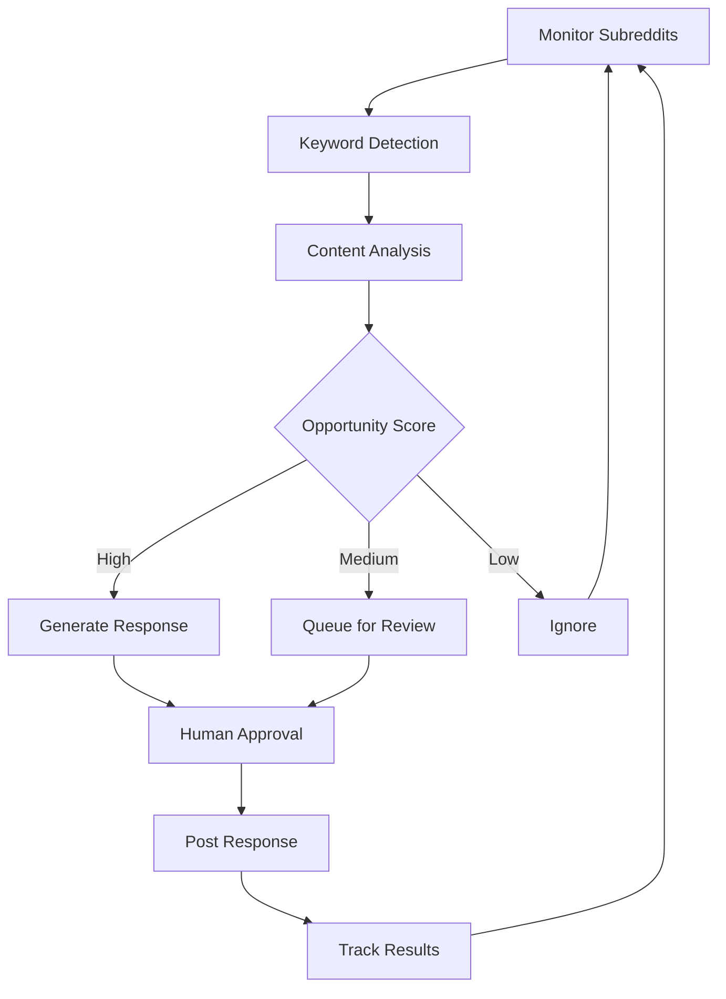
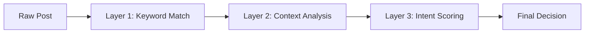
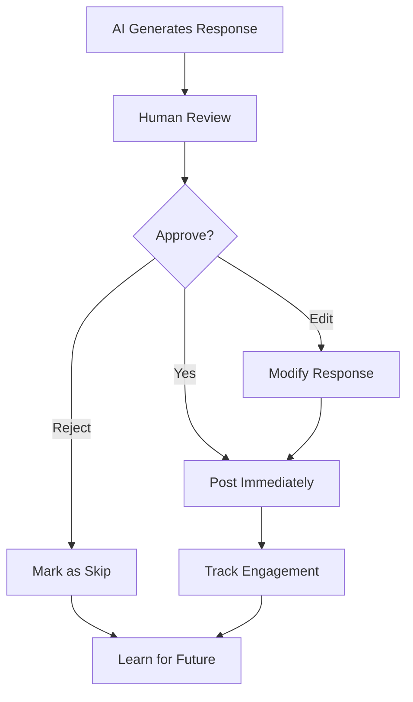

# Reddit Monitoring & Response System - Simple Workflow Design

## Core System Architecture (K.I.S.S. Approach)

### **Input → Filter → Analyze → Respond → Track**



## **Phase 1: Monitoring Setup**

### **1.1 Target Identification**
- **Primary Keywords**: "review management", "ecommerce reviews", "Shopify reviews"
- **Pain Point Keywords**: "fake reviews", "review problems", "low conversion"
- **Competitor Keywords**: "Judge.me", "Yotpo", "Okendo", "Stamped"
- **Solution-Seeking**: "best review app", "review software recommendations"

### **1.2 Subreddit List**
**Tier 1 (High Priority)**
- r/shopify 
- r/ecommerce
- r/Entrepreneur 
- r/smallbusiness

**Tier 2 (Medium Priority)**
- r/marketing
- r/dropship
- r/SaaS
- r/startups

**Tier 3 (Niche Monitoring)**
- r/AskMarketing
- r/reviews
- r/onlinemarketing

## **Phase 2: Content Analysis Flow**

### **2.1 Three-Layer Filtering**



**Layer 1: Keyword Match**
- Exact keyword detection
- Synonym recognition  
- Negative keyword filtering (exclude irrelevant)

**Layer 2: Context Analysis**
- Is this a complaint about competitors?
- Is this someone seeking a solution?
- Is this a problem Loox solves?
- Community sentiment check

**Layer 3: Intent Scoring**
- **Score 8-10**: Direct opportunity (seeking solution NOW)
- **Score 5-7**: Warm lead (has problem, educating)
- **Score 1-4**: Cold/informational (just complaining)

## **Phase 3: Response Generation**

### **3.1 Response Templates by Scenario**

**Scenario A: Competitor Complaint**
```
Template: "I had similar issues with [competitor]. What specific problems are you facing? 
I might have some insights that could help."
```

**Scenario B: Solution Seeking**
```
Template: "For Shopify review management, I've seen good results with a few different approaches. 
What's your current setup and main challenges?"
```

**Scenario C: General Problem**
```
Template: "Review management can definitely be tricky. Are you looking for 
automated collection, better display options, or something else?"
```

### **3.2 Response Approval Workflow**



## **Phase 4: Account Management**

### **4.1 Account Warmup Strategy**
- **Week 1-2**: Pure community participation (no promotion)
- **Week 3-4**: Helpful responses (mention experience, not product)
- **Week 5+**: Gradual introduction of solution (only when directly relevant)

### **4.2 Account Rotation Logic**
- **Account 1**: Primary engagement (most active)
- **Account 2**: Secondary support (backup, different subreddits)
- **Account 3**: Emergency backup (in case of issues)

**Rotation Triggers:**
- Daily comment limit reached (5-8 per account)
- Negative karma threshold (-5)
- Account age milestones

## **Phase 5: Simple Metrics Dashboard**

### **5.1 Daily Tracking**
- Posts monitored
- Opportunities identified  
- Responses posted
- Engagement received (upvotes, replies)
- Clicks to website
- Leads generated

### **5.2 Weekly Analysis**
- Best performing subreddits
- Most effective response templates
- Account health scores
- Conversion funnel metrics

## **Phase 6: Escalation & Risk Management**

### **6.1 Red Flags (Auto-Stop)**
- Downvotes > 3 on any response
- "Spam" mentions in replies
- Mod warnings/removals
- Account shadowban detection

### **6.2 Response Protocol**
1. **Immediate pause** all activity on flagged account
2. **Review** what triggered the issue
3. **Adjust** approach or switch accounts
4. **Wait** 24-48 hours before resuming

## **Implementation Phases**

### **Phase 1: Manual (Week 1-2)**
- Set up monitoring manually
- Test response templates
- Learn community dynamics

### **Phase 2: Semi-Auto (Week 3-4)** 
- Automate monitoring
- Generate response suggestions
- Manual posting with approval

### **Phase 3: Full Auto (Week 5+)**
- Automated posting with rules
- Real-time adjustments
- Scale to more subreddits

---

## **Success Metrics by Phase**

**Week 1-2**: Community acceptance (positive karma)
**Week 3-4**: Response engagement (replies, upvotes)  
**Week 5+**: Lead generation (website visits, conversions)

**Target KPIs**:
- 3-5 quality responses per day
- 70%+ positive response ratio
- 5-10 website visits per week from Reddit
- 1-2 demo requests per month
