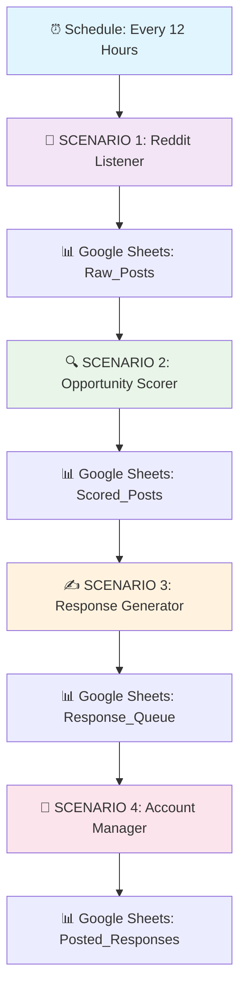
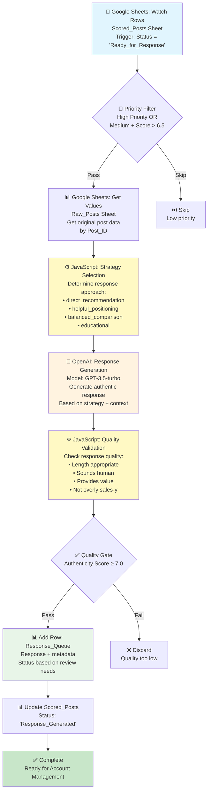
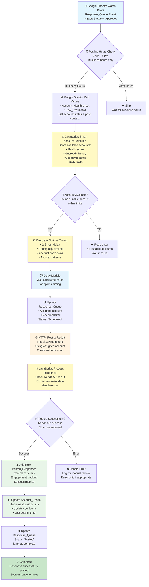
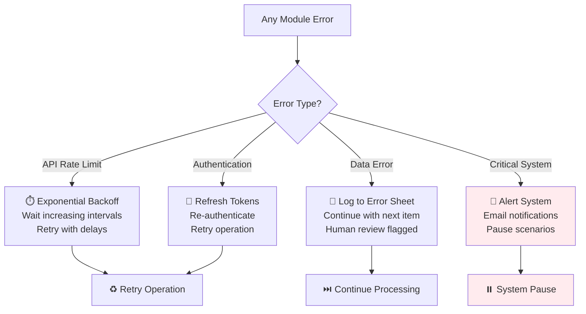
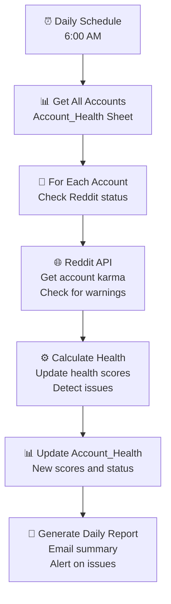
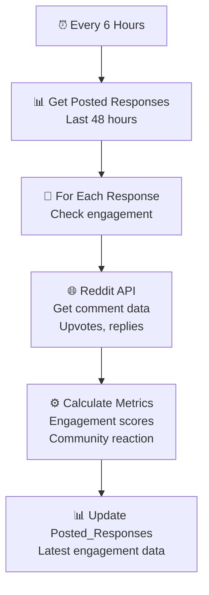

# Make.com Scenarios - Complete Flow Diagrams

## System Overview - All Scenarios Connected



---

## Scenario 1: Reddit Listener
**Purpose:** Monitor Reddit every 12 hours for relevant posts

```mermaid
graph TD
    A[⏰ Schedule Trigger<br/>Every 12 Hours<br/>12:00 PM & 12:00 AM] --> B[🌐 HTTP: Reddit Search<br/>r/shopify<br/>Keywords: review app, judge.me, etc.]
    
    B --> C[🔄 Iterator<br/>Loop through<br/>{{data.children}}]
    
    C --> D{🔍 Filter: New Post?<br/>Check if Post_ID exists<br/>in Raw_Posts Sheet}
    
    D -->|New Post| E{🎯 Filter: Keywords Match?<br/>Check title + content for:<br/>• review app<br/>• shopify reviews<br/>• judge.me, yotpo<br/>• social proof}
    
    D -->|Exists| F[⏭️ Skip<br/>Already processed]
    
    E -->|Match| G[⚙️ JavaScript<br/>Extract & Clean Data:<br/>• Post details<br/>• Author karma<br/>• Matched keywords<br/>• Timestamps]
    
    E -->|No Match| F
    
    G --> H[📊 Google Sheets: Add Row<br/>Raw_Posts Sheet<br/>Status: 'New']
    
    H --> I[🌐 HTTP: Reddit Search<br/>r/ecommerce<br/>Same keyword logic]
    
    I --> J[🌐 HTTP: Reddit Search<br/>r/entrepreneur<br/>Same keyword logic]
    
    J --> K[🌐 HTTP: Reddit Search<br/>r/dropshipping<br/>Same keyword logic]
    
    K --> L[✅ Complete<br/>Wait for next cycle]
    
    style A fill:#e1f5fe
    style G fill:#fff9c4
    style H fill:#e8f5e8
    style L fill:#c8e6c9
```

---

## Scenario 2: Opportunity Scorer
**Purpose:** Analyze new posts and score business opportunities

```mermaid
graph TD
    A[👀 Google Sheets: Watch Rows<br/>Raw_Posts Sheet<br/>Trigger: Status = 'New'] --> B{🔍 Layer 1 Filter<br/>Advanced Keyword Check<br/>Positive keywords AND<br/>NOT negative keywords}
    
    B -->|Pass| C[🤖 OpenAI: Context Analysis<br/>Model: GPT-3.5-turbo<br/>Analyze business context<br/>Return JSON format]
    
    B -->|Fail| D[📊 Update Raw_Posts<br/>Status: 'Filtered_Out']
    
    C --> E[🔧 JSON Parser<br/>Extract AI analysis:<br/>• context_category<br/>• business_relevance<br/>• recommendation]
    
    E --> F{🎯 Layer 2 Filter<br/>business_relevance ≥ 6<br/>authenticity_score ≥ 5<br/>recommendation = 'proceed'}
    
    F -->|Pass| G[⚙️ JavaScript: Layer 3 Scoring<br/>Calculate scores:<br/>• Intent Score (1-10)<br/>• Urgency Score (1-10)<br/>• Authority Score (1-10)<br/>• Final weighted score]
    
    F -->|Fail| H[📊 Update Raw_Posts<br/>Status: 'Low_Priority']
    
    G --> I[📊 Add Row: Scored_Posts<br/>All scores + analysis<br/>Status: 'Ready_for_Response']
    
    I --> J[📊 Update Raw_Posts<br/>Status: 'Analyzed'<br/>Add score summary]
    
    J --> K[✅ Complete<br/>Ready for Response Generation]
    
    style A fill:#e1f5fe
    style C fill:#fff3e0
    style G fill:#fff9c4
    style I fill:#e8f5e8
    style K fill:#c8e6c9
```

---

## Scenario 3: Response Generator
**Purpose:** Generate authentic responses for high-scoring opportunities



---

## Scenario 4: Account Manager & Poster
**Purpose:** Assign accounts, schedule posting, and execute responses



---

## Data Flow Between Scenarios

```mermaid
graph LR
    subgraph "Scenario 1: Monitoring"
        A1[Reddit APIs] --> A2[Raw_Posts Sheet]
    end
    
    subgraph "Scenario 2: Analysis"
        B1[Raw_Posts Watch] --> B2[AI Analysis] --> B3[Scored_Posts Sheet]
    end
    
    subgraph "Scenario 3: Response Gen"
        C1[Scored_Posts Watch] --> C2[Response Generation] --> C3[Response_Queue Sheet]
    end
    
    subgraph "Scenario 4: Posting"
        D1[Response_Queue Watch] --> D2[Account Management] --> D3[Posted_Responses Sheet]
    end
    
    A2 --> B1
    B3 --> C1
    C3 --> D1
    
    style A2 fill:#e8f5e8
    style B3 fill:#e8f5e8
    style C3 fill:#e8f5e8
    style D3 fill:#e8f5e8
```



---

## Error Handling Flow



---

## Daily Maintenance Scenarios

### Scenario 5: Health Monitor


### Scenario 6: Engagement Tracker


---

## Module Legend

| Symbol | Module Type | Purpose |
|--------|-------------|---------|
| ⏰ | Schedule | Time-based triggers |
| 👀 | Google Sheets Watch | Monitor sheet changes |
| 📊 | Google Sheets Add/Update | Write to sheets |
| 🌐 | HTTP | API calls (Reddit, OpenAI) |
| ⚙️ | JavaScript | Custom logic processing |
| 🔄 | Iterator | Loop through arrays |
| 🎯 | Filter | Conditional routing |
| 🤖 | OpenAI | AI analysis calls |
| 🔧 | JSON Parser | Parse API responses |
| ⏱️ | Delay | Timing controls |
| ✅ | Success Path | Completed successfully |
| ❌ | Error Path | Handle failures |
| ⏭️ | Skip | Bypass processing |

This visual system helps you understand exactly how data flows through each scenario and how the modules connect to create your complete Reddit monitoring automation.
